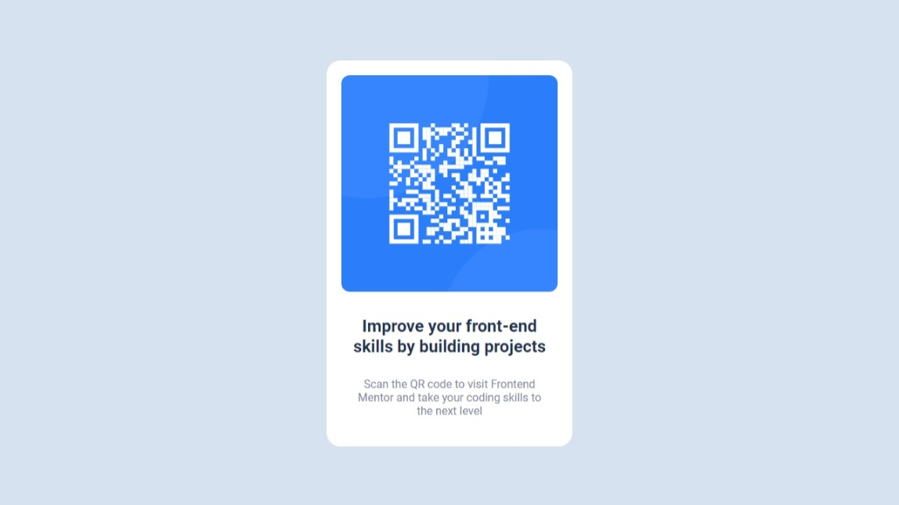

# Frontend Mentor - QR code component solution

This is a solution to the [QR code component challenge on Frontend Mentor](https://www.frontendmentor.io/challenges/qr-code-component-iux_sIO_H). Frontend Mentor challenges help you improve your coding skills by building realistic projects.

## Table of contents

- [Overview](#overview)
  - [Screenshot](#screenshot)
  - [Links](#links)
- [My process](#my-process)
  - [Built with](#built-with)
  - [What I learned](#what-i-learned)
  - [Continued development](#continued-development)
  - [Useful resources](#useful-resources)
- [Author](#author)
- [Acknowledgments](#acknowledgments)

## Overview

### Screenshot

### Links

- Live Site URL: [QR Card](https://bdescalzo.github.io/qrcard-frontendmentor)

## My process

### Built with

- HTML5
- CSS properties
- (A bit of) Flexbox

### What I learned

With this project, I mainly practised what I already knew. However, it was specially useful to practice with centering elements.

### Continued development

In future projects, I want to start creating real layouts, using Flex, Grid, media queries... for now, this is a good start!

### Useful resources

- [This](https://stackoverflow.com/questions/48516538/flex-align-items-center-not-centering-items) Stack Overflow answer and [this](https://www.w3schools.com/howto/howto_css_center-vertical.asp) W3Schools page were specially useful to center the card both vertically and horizontally.

## Author

- GitHub - [@bdescalzo](https://www.github.com/bdescalzo)
- Frontend Mentor - [@bdescalzo](https://www.frontendmentor.io/profile/bdescalzo)
- Twitter - [@BenatDescalzo](https://www.twitter.com/BenatDescalzo)

## Acknowledgments

I'd like to thank [Jordan Alexander](https://twitter.com/alexcgdesign), whose [course](https://www.cursocss.com) is giving me a great CSS foundation.
